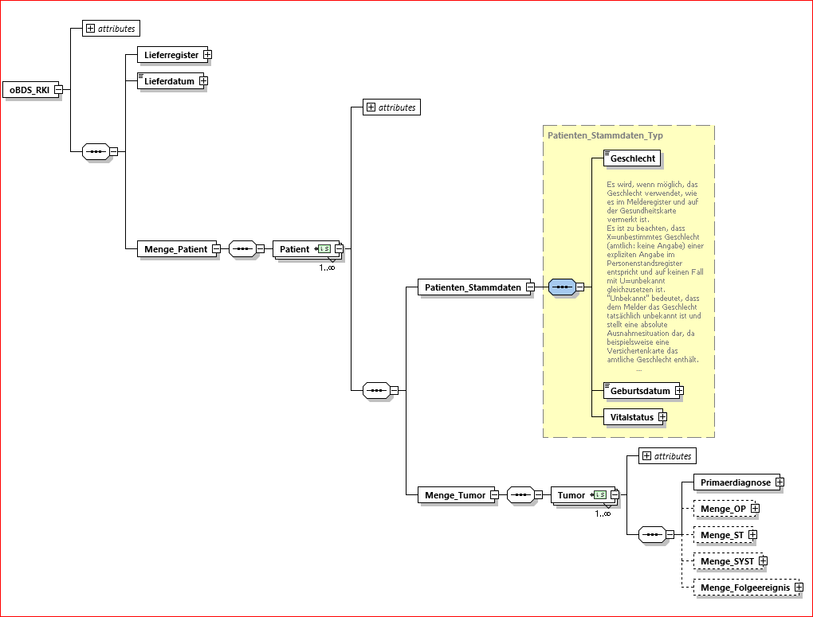
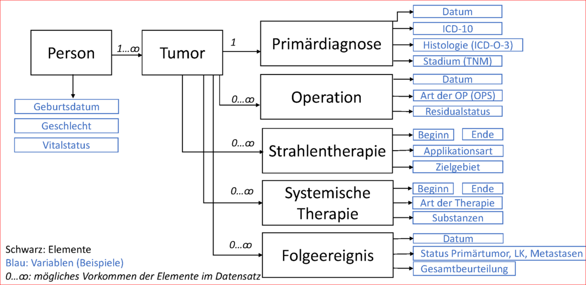

# Metadaten zum bundesweiten klinisch-epidemiologischen Krebsdatensatz

**Robert Koch-Institut | RKI**  
Nordufer 20  
13353 Berlin

**Projektteam klinische Daten**  
[Stefan Meisegeier](https://orcid.org/0000-0003-2347-1836 "ORCiD") (Projektleitung)  
[Maren Imhoff](https://orcid.org/0009-0001-0030-566X "ORCiD") (Data Manager)  
Karsten Berg (Data Analyst)

**Zentrum für Krebsregisterdaten | ZfKD**  
[Klaus Kraywinkel](https://orcid.org/0000-0002-9250-6003 "ORCiD") (Leitung ZfKD)

E-Mail-Adresse für Rückmeldungen: krebsdaten@rki.de

## Der klinisch-epidemiologische Datensatz

> Abbildung 1: Übersicht zum XML-Schema des klinischen Datensatzes

Das Zentrum für Krebsregisterdaten (ZfKD) führt nach Vorgabe des [Bundeskrebsregisterdatengesetzes (BKRG)](https://www.gesetze-im-internet.de/bkrg/BJNR270700009.html) Daten der Landeskrebsregister zu einem bundesweiten klinisch-epidemiologischen Datensatz zusammen und stellt sie [auf Antrag für wissenschaftliche Forschungsprojekte](https://www.krebsdaten.de/info_antrag) zur Verfügung.

Die obenstehende Abbildung veranschaulicht die Struktur des klinisch-epidemiologischen Datensatzes.

Das [XML-Schema](#xml-schema) des klinisch-epidemiologischen Datensatzes wird als `oBDS-RKI` bezeichnet. Die Bezeichnung geht zurück auf den zwischen der Arbeitsgemeinschaft Deutscher Tumorzentren e. V. (ADT), der Gesellschaft der epidemiologischen Krebsregister in Deutschland (GEKID) und der Plattform § 65c abgestimmten `einheitlichen onkologischen Basisdatensatz` (`oBDS`), der für die Entwicklung des `oBDS-RKI` als Vorlage und Arbeitsgrundlage diente. An der Entwicklung des `oBDS-RKI` waren Vertreterinnen und Vertreter der Plattform § 65c, der ADT, der GEKID und des ZfKD beteiligt.

Weil er die Struktur und Inhalte der von den Landeskrebsregistern ans ZfKD zu liefernden Daten definiert, wird der `oBDS-RKI` auch als `ZfKD-Lieferdatensatz` bezeichnet.

Näheres zur Abstimmung und Entwicklung des klinisch-epidemiologischen Datensatzes erfahren Sie auf den Internetseiten der [Plattform § 65c](https://plattform65c.atlassian.net/wiki/spaces/P6/overview).

## Datenangebot und Navigation

In diesem Repository stellen wir _Metadaten_ und begleitende Informationen zur [Struktur](#struktur-des-datensatzes) und zu [Inhalten](#inhalte-des-datensatzes) des bundesweiten klinisch-epidemiologischen Datensatzes zur Verfügung.

💡 Der Datensatz selbst ist nicht öffentlich zugänglich, kann aber auf Antrag für wissenschaftliche Forschungszwecke genutzt werden. Bitte verwenden Sie für Fragen zur Antragstellung das auf der Internetseite des ZfKD bereitgestellte [Kontaktformular](https://www.krebsdaten.de/SharedDocs/Kontaktformulare/A/Antrag-krebsdaten/Integrator_SCU.html). Informationen zum gesetzlichen Auftrag, zu Methoden und Veröffentlichungen des ZfKD erhalten Sie ebenfalls auf den [Internetseiten des ZfKD](https://www.krebsdaten.de/).

Bei der Navigation innerhalb dieses Dokuments hilft das Inhaltsverzeichnis oben links (Icon neben dem Namen dieser Readme-Datei).

Unser Informationsangebot richtet sich an alle, die Daten beitragen und/oder diese nutzen (möchten).

### Gliederung des Repository

📦repository  
┣ 📂dateien  
┃ ┣ 📂01_klassifikationen  
┃ ┃ ┣ 📜...  
┃ ┣ 📂02_schema  
┃ ┃ ┣ 📜...  
┃ ┣ 📂03_nutzungsbedingungen  
┃ ┃ ┣ 📜...  
┃ ┗ 📂04_sample-output  
┃ ┃ ┣ 📜...  
┣ 📂img  
┃ ┣ 📜...  
┗ 📜readme.md

> Abbildung 2: Gliederung des Repository.

Das Repository ist in folgende Ordner 📁 gegliedert:

- **dateien**: alle hier beschrieben Dateien zum Download
- **01_klassifikationen**: Referenztabellen für Variablen des Datensatzes und ihre definierten Ausprägungen, näheres [hier](#inhalte-des-datensatzes)
- **02_schema**: Dateien zum XML-Schema des Datensatzes, näheres [hier](#struktur-des-datensatzes)
- **03_nutzungsbedingungen**: Einige Referenztabellen geben Inhalte von Standards wieder, die von Dritten (z. B. BfArM, WIdO) herausgegeben werden. Unter Umständen verbinden diese Anbieter die Nutzung ihrer Produkte mit Bedingungen. Die Nutzungsbedingungen sind hier abgelegt. Wir bitten Sie diese zu beachten.
- **04_sample-output**: Ordner zur Veranschaulichung des Bereitstellungsprozesses der Daten. Näheres unter [Beispieldaten](#beispieldaten)
- **img**: auf der readme-Seite verwendete Abbildungen

## Struktur des Datensatzes

Die klinisch-epidemiologischen Daten werden nicht - wie ursprünglich die [epidemiologischen Daten des ZfKD](https://www.krebsdaten.de/Krebs/DE/Content/Forschungsdatensatz/Informationen_datensatz/epidemiologischer_datensatz/epidemiologischer_datensatz_node.html) (basierend auf dem BKRG in seiner Fassung vom 18.08.2009) - in einer einfachen „Rechtecktabelle“ abgebildet, in der Erkrankungsfälle als Zeilen und Variablen als Spalten dargestellt sind. Im klinisch-epidemiologischen Datensatz sind die Daten in einem verschachtelten XML-Schema strukturiert.

Der klinisch-epidemiologische Datensatz wird durch folgende Elemente gegliedert:

- Die _Person_ bildet die grundlegende Einheit im Datensatz.
- Der Person zugeordnet ist mindestens ein Element _Tumor_.
- Das Element _Tumor_ enthält ein verpflichtendes Element _Primärdiagnose_. Dieses enthält u. a. Angaben zum Tumorstadium, zur Histologie und Lokalisation des Tumors.
- Darüber hinaus sind dem Element _Tumor_ mehrere optionale Elemente zugeordnet, in denen Angaben zur Behandlung (Elemente _OP_, _ST_ und _SYST_) und zu Folgeereignissen (Element _Folgeereignis_) wie Remissionen und Rezidiven erfasst werden können.

Die Elemente _Primärdiagnose_, _Folgeereignis_, _OP_, _ST_ und _SYST_ können mehrfach verwendet werden, so dass auch komplexe Krankheitsverläufe abgebildet werden können. Die Inhalte eines Elements können in ein tabellarisches Format überführt und über eine fallbezogene Nummer mit anderen Tabellen aus dem Datensatz verknüpft werden. Auf diese Weise entsteht ein auswertbares Format, in dem die bewilligten Daten an den Datenempfänger übermittelt werden können (beispielsweise als `.csv`).

> Abbildung 3: Vereinfachtes Datenschema (mit ausgewählten Variablen). Quelle: [krebsdaten.de](https://www.krebsdaten.de/Krebs/DE/Content/Forschungsdatensatz/forschungsdatensatz_node.html).

### XML-Schema

Die derzeit gültige Version des XML-Schemas ist `3.0.0.8a_RKI` vom `2023-01-06`.

> 💡 Die Bezeichnung orientiert sich an der dem Datensatz zugrunde liegenden Version des oBDS. Ergänzt wird die Bezeichnung durch eine Versionsnummer und den Suffix \_RKI. So ist etwa die Angabe 3.0.0.6_RKI zu interpretieren als: Entwicklungsversion 6 des oBDS-RKI, basierend auf oBDS 3.0.0.

#### Downloads

An dieser Stelle können die XML-Schema-Definition und weitere ergänzende Dateien zur Datensatz-Struktur heruntergeladen werden.

| Datei                                | Beschreibung                                                                                                                                                                                                                                                                                                                                                                                                                                                       | Download                                                 |
| ------------------------------------ | ------------------------------------------------------------------------------------------------------------------------------------------------------------------------------------------------------------------------------------------------------------------------------------------------------------------------------------------------------------------------------------------------------------------------------------------------------------------ | -------------------------------------------------------- |
| Schemadatei                          | Die XML-Schema-Definition `.xsd` als eindeutige, vollständige und maschinenlesbare Repräsentation des gesamten Schemas mit allen Details. Zur Betrachtung der Inhalte dieser Datei ist die Verwendung einer geeigneten Software empfohlen. Detaillierte [technische Informationen zum XML-Schema](https://plattform65c.atlassian.net/wiki/spaces/P6/pages/2064400/XML-Schema) sind auf der Internetseite der Plattform § 65c abrufbar (bis Version `3.0.0.8_RKI`). | [💾](dateien/02_schema/oBDS_v3.0.0.8a_RKI_Schema.xsd)    |
| Abbildung                            | Die grafische Darstellung des XML-Schemas als `.pdf`. Nicht alle Elemente sind abgebildet. Hinweise zur Notation des XML-Schemas sind [hier](https://plattform65c.atlassian.net/wiki/spaces/P6/pages/59015169/Legende+zur+grafischen+Notation+des+XML-Schemas) zu finden.                                                                                                                                                                                          | [💾](dateien/02_schema/oBDS_v3.0.0.8a_RKI_Bild.pdf)      |
| Differenzdatei ("diff")              | Eine `.txt` Datei als Extrakt der wesentlichen Schemainformationen. Die Datei wird generiert durch eine Transformation des Schemas und ermöglicht einen schnellen Überblick sowie die Differenzbildung zwischen Versionen.                                                                                                                                                                                                                                         | [💾](dateien/02_schema/oBDS_v3.0.0.8a_RKI_Diff.txt)      |
| Variablenübersicht                   | Variablen und mögliche Ausprägungen in tabellarischer Darstellung als `.csv`.                                                                                                                                                                                                                                                                                                                                                                                      | [💾](dateien/02_schema/oBDS_v3.0.0.8a_RKI_Variablen.csv) |
| Variablenübersicht als "Cheat sheet" | Kurzübersicht über Variablen und mögliche Ausprägungen als `.pdf`.                                                                                                                                                                                                                                                                                                                                                                                                 | [💾](dateien/02_schema/oBDS_v3.0.0.8a_RKI_Variablen.pdf) |
| Testdatensatz                        | Ein einfacher Testdatensatz als `.xml`-Datei mit Werten in zufälliger Verteilung. Medizinische Zusammenhänge sind nicht berücksichtigt. Näheres unter [Beispieldaten](#beispieldaten)                                                                                                                                                                                                                                                                              | [💾](dateien/02_schema/oBDS_v3.0.0.8a_RKI_Sample.xml)    |

### Release Notes

Die release notes zu den Versionen des XML-Schemas sind [hier](release-notes.md) zu finden

## Inhalte des Datensatzes

Das Datenschema umfasst mehr als 120 Variablen, die verschiedenen Elementen zugeordnet sind (siehe [Struktur](#struktur-des-datensatzes)).

### Verpflichtende und optionale Angaben

Bestimmte Variablen sind Pflichtangaben, z. B. das _Geburtsdatum_, der _Inzidenzort_ und der _Diagnoseschlüssel_. Viele Angaben sind optional, z. B. die den Elementen cTNM und pTNM zugeordneten Variablen (_T-Kategorie_, _UICC-Stadium_, _m-Suffix_ usw.). Einige Angaben sind nur unter der Bedingung verpflichtend, dass das übergeordnete, optionale Element verwendet wird: Beispielsweise ist das Element Histologie optional. Wird jedoch in der zugehörigen Variable _Morphologie_ ein Eintrag vorgenommen, ist auch eine Angabe zum _Grading_ verpflichtend. Angaben zur Zahl untersuchter Lymphknoten bleiben optional.

Zusammenhänge und Abhängigkeiten zwischen den Variablen veranschaulicht die im [Downloadbereich](#downloads) verfügbare Abbildung.

Bei Auswertungen ist zu beachten, dass optionale Inhalte möglicherweise nicht gleichermaßen aus allen Bundesländern vorliegen.

### Ausprägungen

Die für einzelne Variablen erwarteten Ausprägungen und ihre Beschreibung sind in [Referenztabellen](#referenztabellen) hinterlegt. Einzelne Referenzen werden für mehrere Variablen genutzt: Beispielsweise wird für den Östrogen-Rezeptorstatus und den Progesteron-Rezeptorstatus die gleiche Kodierung verwendet. Ebenso werden für die Angaben zur klinischen und pathologischen TNM die gleichen Referenztabellen genutzt.

Größtenteils handelt es sich bei den Referenzen um Vereinbarungen, die bei der Erarbeitung des ZfKD-Lieferdatensatzes getroffen wurden (z. B. Ausprägungen von Variablen im Element Strahlentherapie, Ausprägungen von _Diagnosesicherung_). Teilweise handelt es sich bei den Referenzen um internationale oder nationale Standards (z. B. TNM, ATC-Klassifikation für den deutschen Arzneimittelmarkt). Informationen zu Quelle und Version der jeweiligen Referenzwerte, zu ihrer Interpretation und zu gegebenenfalls bestehenden Nutzungsbedingungen der Herausgeber sind im Abschnitt [Details](#details) zusammengestellt.

#### Formatierung

Die nachfolgend aufgeführten Referenztabellen sind einheitlich formatiert:

- Zeichensatz: `UTF-8_with_BOM` (dieses Format erleichtert die Bearbeitung in MS Excel, da Umlaute hier korrekt dargestellt werden)
- Datumsformat: `ISO 8601`
- Dateiformat: `.csv`
- Trennzeichen: Semikolon `;`

#### Referenztabellen

| Tabelle                                                                        | Eigenschaft                                   | verwendet für*Element* `technische Variablenbezeichnung`                                                                                                                                                                                                                                                                                    |
| ------------------------------------------------------------------------------ | --------------------------------------------- | ------------------------------------------------------------------------------------------------------------------------------------------------------------------------------------------------------------------------------------------------------------------------------------------------------------------------------------------- |
| [atemgetriggert.csv](dateien/01_klassifikationen/atemgetriggert.csv)           | Angabe zur perkutanen Strahlentherapie        | _Strahlentherapie_ `Atemgetriggert`                                                                                                                                                                                                                                                                                                         |
| [beurteilung_gesamt.csv](dateien/01_klassifikationen/beurteilung_gesamt.csv)   | Folgeereignis - Gesamtbeurteilung Tumorstatus | _Folgeereignis_ `Gesamtbeurteilung_Tumorstatus`                                                                                                                                                                                                                                                                                             |
| [beurteilung_lokal.csv](dateien/01_klassifikationen/beurteilung_lokal.csv)     | Folgeereignis - Beurteilung Primärtumor       | _Folgeereignis_ `Verlauf_Lokaler_Tumorstatus`                                                                                                                                                                                                                                                                                               |
| [diagnosesicherung.csv](dateien/01_klassifikationen/diagnosesicherung.csv)     | Wertigkeit der Diagnosesicherung              | _Primärdiagnose_ `Diagnosesicherung`                                                                                                                                                                                                                                                                                                        |
| [fm_lokalisation.csv](dateien/01_klassifikationen/fm_lokalisation.csv)         | Lokalisation der Fernmetastasen               | _Primärdiagnose_ `Lokalisation`, _Folgeereignis_ `Lokalisation`                                                                                                                                                                                                                                                                             |
| [geschlecht.csv](dateien/01_klassifikationen/geschlecht.csv)                   | Geschlecht                                    | _Person_ `Geschlecht`                                                                                                                                                                                                                                                                                                                       |
| [gleason_anlass.csv](dateien/01_klassifikationen/gleason_anlass.csv)           | Modul Prostata: Anlass der Probenahme         | _Primärdiagnose_ `AnlassGleasonScore`                                                                                                                                                                                                                                                                                                       |
| [gleason_score.csv](dateien/01_klassifikationen/gleason_score.csv)             | Modul Prostata: Gleason-Score                 | _Primärdiagnose_ `ScoreErgebnis`                                                                                                                                                                                                                                                                                                            |
| [grading.csv](dateien/01_klassifikationen/grading.csv)                         | Differenzierungsgrad                          | _Primärdiagnose_ `Grading`                                                                                                                                                                                                                                                                                                                  |
| [hormonrezeptor.csv](dateien/01_klassifikationen/hormonrezeptor.csv)           | Modul Mamma: Hormonrezeptorstatus             | _Primärdiagnose_ `HormonrezeptorStatus_Oestrogen`, _Primärdiagnose_ `HormonrezeptorStatus_Progesteron`                                                                                                                                                                                                                                      |
| [icd10_todesursache.csv](dateien/01_klassifikationen/icd10_todesursache.csv)   | Todesursache, Grundleiden nach ICD-10         | _Todesursachen_ `Code`                                                                                                                                                                                                                                                                                                                      |
| [icd10_version.csv](dateien/01_klassifikationen/icd10_version.csv)             | Ausgabe der ICD-10                            | _Todesursachen_ `Version`, _Primärdiagnose_ `Diagnose_ICD10_Version`                                                                                                                                                                                                                                                                        |
| [icd10.csv](dateien/01_klassifikationen/icd10.csv)                             | Diagnose nach ICD-10                          | _Primärdiagnose_ `Diagnose_ICD10_Code`                                                                                                                                                                                                                                                                                                      |
| [interstitiell.csv](dateien/01_klassifikationen/interstitiell.csv)             | Angabe zur Kontaktbestrahlung                 | _Strahlentherapie_ `Interstitiell_endokavitaer`                                                                                                                                                                                                                                                                                             |
| [landkreis.csv](dateien/01_klassifikationen/landkreis.csv)                     | Wohnort bei Diagnose                          | _Primärdiagnose_ `Inzidenzort`, _Primärdiagnose_ `Inzidenzort_BL`                                                                                                                                                                                                                                                                           |
| [menopause.csv](dateien/01_klassifikationen/menopause.csv)                     | Modul Mamma: Menopausenstatus                 | _Primärdiagnose_ `Praetherapeutischer_Menopausenstatus`                                                                                                                                                                                                                                                                                     |
| [metabolisch.csv](dateien/01_klassifikationen/metabolisch.csv)                 | Typ der metabolischen Strahlentherapie        | _Strahlentherapie_ `Metabolisch_Typ`                                                                                                                                                                                                                                                                                                        |
| [morphologie_version.csv](dateien/01_klassifikationen/morphologie_version.csv) | Quelle Morphologie                            | _Primärdiagnose_ `Morphologie_Version`                                                                                                                                                                                                                                                                                                      |
| [morphologie.csv](dateien/01_klassifikationen/morphologie.csv)                 | Morphologie                                   | _Primärdiagnose_ `Morphologie_Code`                                                                                                                                                                                                                                                                                                         |
| [op_intention.csv](dateien/01_klassifikationen/op_intention.csv)               | Intention der OP                              | _Operation_ `Intention`                                                                                                                                                                                                                                                                                                                     |
| [ops.csv](dateien/01_klassifikationen/ops.csv)                                 | Art der OP                                    | _Operation_ `Code`                                                                                                                                                                                                                                                                                                                          |
| [protokoll.csv](dateien/01_klassifikationen/protokoll.csv)                     | Therapieprotokoll                             | _Systemische Therapie_ `Protokoll_TypProtokollschluessel_Code`                                                                                                                                                                                                                                                                              |
| [radiochemo.csv](dateien/01_klassifikationen/radiochemo.csv)                   | Ausführung der perkutanen Radiochemotherapie  | _Strahlentherapie_ `Radiochemo`                                                                                                                                                                                                                                                                                                             |
| [rasmutation.csv](dateien/01_klassifikationen/rasmutation.csv)                 | Modul Darm: Mutation K-ras-Onkogen            | _Primärdiagnose_ `RASMutation`                                                                                                                                                                                                                                                                                                              |
| [rate.csv](dateien/01_klassifikationen/rate.csv)                               | Dosisleistung Kontaktbestrahlung              | _Strahlentherapie_ `Rate_Type`                                                                                                                                                                                                                                                                                                              |
| [seite_zielgebiet.csv](dateien/01_klassifikationen/seite_zielgebiet.csv)       | Körperseite der bestrahlten Region            | _Strahlentherapie_ `Seite_Zielgebiet`                                                                                                                                                                                                                                                                                                       |
| [seitenlokalisation.csv](dateien/01_klassifikationen/seitenlokalisation.csv)   | Seitenlokalisation bei paarigen Organen       | _Primärdiagnose_ `Seitenlokalisation`                                                                                                                                                                                                                                                                                                       |
| [st_intention.csv](dateien/01_klassifikationen/st_intention.csv)               | Intention der Strahlentherapie                | _Strahlentherapie_ `Intention`                                                                                                                                                                                                                                                                                                              |
| [st_op_stellung.csv](dateien/01_klassifikationen/st_op_stellung.csv)           | Bezug Strahlentherapie - OP                   | _Strahlentherapie_ `Stellung_OP`                                                                                                                                                                                                                                                                                                            |
| [stereotaktisch.csv](dateien/01_klassifikationen/stereotaktisch.csv)           | Angabe zur perkutanen Strahlentherapie        | _Strahlentherapie_ `Stereotaktisch`                                                                                                                                                                                                                                                                                                         |
| [substanz.csv](dateien/01_klassifikationen/substanz.csv)                       | Verwendete Substanz(en)                       | _Systemische Therapie_ `TypeOfSYST_TypSubstanz`                                                                                                                                                                                                                                                                                             |
| [syst_intention.csv](dateien/01_klassifikationen/syst_intention.csv)           | Intention der systemischen Therapie           | _Systemische Therapie_ `Intention`                                                                                                                                                                                                                                                                                                          |
| [syst_op_stellung.csv](dateien/01_klassifikationen/syst_op_stellung.csv)       | Bezug systemische Therapie - OP               | _Systemische Therapie_ `Stellung_OP`                                                                                                                                                                                                                                                                                                        |
| [therapieart.csv](dateien/01_klassifikationen/therapieart.csv)                 | Art der systemischen Therapie                 | _Systemische Therapie_ `Therapieart`                                                                                                                                                                                                                                                                                                        |
| [tnm_auflage.csv](dateien/01_klassifikationen/tnm_auflage.csv)                 | TNM-Ausgabe                                   | _Primärdiagnose_ `TNM_Auflage_c`, _Primärdiagnose_ `TNM_Auflage_p`, _Folgeereignis_ `Version`                                                                                                                                                                                                                                               |
| [tnm_cpu.csv](dateien/01_klassifikationen/tnm_cpu.csv)                         | TNM-Präfix (c, p, u)                          | _Primärdiagnose_ `c_p_u_Praefix_T_c`, _Primärdiagnose_ `c_p_u_Praefix_N_c`, _Primärdiagnose_ `c_p_u_Praefix_M_c`, _Primärdiagnose_ `c_p_u_Praefix_T_p`, _Primärdiagnose_ `c_p_u_Praefix_N_p`, _Primärdiagnose_ `c_p_u_Praefix_M_p`, _Folgeereignis_ `c_p_u_Praefix_T`, _Folgeereignis_ `c_p_u_Praefix_N`, _Folgeereignis_ `c_p_u_Praefix_M` |
| [tnm_l.csv](dateien/01_klassifikationen/tnm_l.csv)                             | TNM: Lymphgefäßinvasion                       | _Primärdiagnose cTNM_ `L_p`, _Primärdiagnose pTNM_ `L_p`, _Folgeereignis_ `L`                                                                                                                                                                                                                                                               |
| [tnm_m.csv](dateien/01_klassifikationen/tnm_m.csv)                             | TNM: Fernmetastasierung                       | _Primärdiagnose cTNM_ `M_c`, _Primärdiagnose pTNM_ `M_p`, _Folgeereignis_ `M`                                                                                                                                                                                                                                                               |
| [tnm_n.csv](dateien/01_klassifikationen/tnm_n.csv)                             | TNM: Regionäre Lymphknotenmetastasierung      | _Primärdiagnose cTNM_ `N_c`, _Primärdiagnose pTNM_ `N_p`, _Folgeereignis_ `N`                                                                                                                                                                                                                                                               |
| [tnm_pn.csv](dateien/01_klassifikationen/tnm_pn.csv)                           | TNM: Perineuralinvasion                       | _Primärdiagnose cTNM_ `Pn_c`, _Primärdiagnose pTNM_ `Pn_p`, _Folgeereignis_ `Pn`                                                                                                                                                                                                                                                            |
| [tnm_s.csv](dateien/01_klassifikationen/tnm_s.csv)                             | TNM: Serumtumormarker                         | _Primärdiagnose cTNM_ `S_c`, _Primärdiagnose pTNM_ `S_p`, _Folgeereignis_ `S`                                                                                                                                                                                                                                                               |
| [tnm_t.csv](dateien/01_klassifikationen/tnm_t.csv)                             | TNM: Ausdehnung des Primärtumors              | _Primärdiagnose cTNM_ `T_c`, _Primärdiagnose pTNM_ `T_p`, _Folgeereignis_ `T`                                                                                                                                                                                                                                                               |
| [tnm_uicc.csv](dateien/01_klassifikationen/tnm_uicc.csv)                       | TNM: UICC-Stadium                             | _Primärdiagnose cTNM_ `UICC_Stadium_c`, _Primärdiagnose pTNM_ `UICC_Stadium_p`, _Folgeereignis_ `UICC_Stadium`                                                                                                                                                                                                                              |
| [tnm_v.csv](dateien/01_klassifikationen/tnm_v.csv)                             | TNM: Veneninvasion                            | _Primärdiagnose cTNM_ `V_c`, _Primärdiagnose pTNM_ `V_p`, _Folgeereignis_ `V`                                                                                                                                                                                                                                                               |
| [topographie_version.csv](dateien/01_klassifikationen/topographie_version.csv) | Ausgabe der ICD-O                             | _Primärdiagnose_ `Topographie_Version`                                                                                                                                                                                                                                                                                                      |
| [topographie.csv](dateien/01_klassifikationen/topographie.csv)                 | Topographie                                   | _Primärdiagnose_ `Topographie_Code`                                                                                                                                                                                                                                                                                                         |
| [verlauf_fern.csv](dateien/01_klassifikationen/verlauf_fern.csv)               | Verlauf: Fernmetastasierung                   | _Folgeereignis_ `Verlauf_Tumorstatus_Fernmetastasen`                                                                                                                                                                                                                                                                                        |
| [verlauf_lokal.csv](dateien/01_klassifikationen/verlauf_lokal.csv)             | Verlauf: Lokaler Tumorstatus                  | _Folgeereignis_ `Verlauf_Lokaler_Tumorstatus`                                                                                                                                                                                                                                                                                               |
| [verlauf_lymphe.csv](dateien/01_klassifikationen/verlauf_lymphe.csv)           | Verlauf: Regionärer Lymphknotenstatus         | _Folgeereignis_ `Verlauf_Tumorstatus_Lymphknoten`                                                                                                                                                                                                                                                                                           |
| [zielgebiet2014.csv](dateien/01_klassifikationen/zielgebiet2014.csv)           | Zielgebiet Strahlentherapie oBDS2014          | _Strahlentherapie Perkutan_ `CodeVersion2014`, _Strahlentherapie Kontakt_ `CodeVersion2014`, _Strahlentherapie Metabolisch_ `CodeVersion2014`, _Strahlentherapie Sonstige_ `CodeVersion2014`, _Strahlentherapie Unbekannt_ `CodeVersion2014`                                                                                                |
| [zielgebiet2021.csv](dateien/01_klassifikationen/zielgebiet2021.csv)           | Zielgebiet Strahlentherapie oBDS2021          | _Strahlentherapie Perkutan_ `CodeVersion2021`, _Strahlentherapie Kontakt_ `CodeVersion2021`, _Strahlentherapie Metabolisch_ `CodeVersion2021`, _Strahlentherapie Sonstige_ `CodeVersion2021`, _Strahlentherapie Unbekannt_ `CodeVersion2021`                                                                                                |

#### Datumsangaben

Die Angabe _Tag_ wird von den Registern grundsätzlich _nicht_ ans ZfKD übermittelt. Das ZfKD legt den Tag auf einen beliebigen Wert fest (i. d. R. 15), so dass immer ein Datum im Format _Jahr-Monat-Tag_ vorliegt.

Für jede Datumsangabe im Datensatz liegen jeweils zwei Variablen vor:

- das `Datum` im internationalen Datumsformat _YYYY-MM-DD_ und
- die `Genauigkeit` des Datums in einer von drei möglichen Ausprägungen (_M_, _T_, _V_):
  _M_ = nur das Jahr ist bekannt (jahrgenau)
  _T_ = Jahr und Monat sind bekannt (monatsgenau)
  _V_ = Jahr und Monat wurden geschätzt

### Details

In diesem Abschnitt stellen wir sukzessive ergänzende Informationen zu den Inhalten der [Referenztabellen](#referenztabellen) zusammen (Hinweise zu Spaltenbezeichnungen, genutzten Quellen usw.).

#### [ICD-10-GM Diagnose](dateien/01_klassifikationen/icd10.csv)

Die Erstellung der Referenztabelle erfolgte unter Verwendung der maschinenlesbaren Fassung der ICD-10-GM (Version 2008) des Bundesinstituts für Arzneimittel und Medizinprodukte (BfArM) (1), unter Verwendung der Empfehlungen des GKV-Spitzenverbands für die klinische Krebsregistrierung (Stand: 14.05.2020) (2) und unter Verwendung des Umsetzungsleitfadens der Plattform § 65c (Stand: 06.06.2023) (3).

Spalten der Referenztabelle:

- `id`: Diagnoseschlüssel, 4-Steller werden ohne Trennzeichen dargestellt (z. B. C021)
- `code`: Diagnoseschlüssel, 4-Steller werden mit Trennzeichen dargestellt (z. B. C02.1)
- `name`: Beschreibung der Diagnose (deutschsprachig)
- `id3`: 3-stelliger Diagnoseschlüssel
- `epi_valide`: TRUE = Diagnose ist im [epidemiologischen Datensatz](https://www.krebsdaten.de/Krebs/DE/Content/Forschungsdatensatz/Informationen_datensatz/epidemiologischer_datensatz/epidemiologischer_datensatz_node.html) des ZfKD enthalten
- `p65_valide`: TRUE = es besteht eine Meldepflicht für den klinisch-epidemiologischen Datensatz (lt. Plattform § 65c-Umsetzungsleitfaden)

> Referenzen:
> (1) ICD-10-GM, BfArM: https://www.bfarm.de/DE/Kodiersysteme/Services/Downloads/_node.html -- **[Nutzungsbedingungen](nutzungsbedingungen/bfarm_tou_icd10_ops.pdf)**
> (2) GKV-Spitzenverband: https://www.gkv-spitzenverband.de/krankenversicherung/qualitaetssicherung_2/klinisches_krebsregister.jsp
> (3) Plattform § 65c: https://confluence.basisdatensatz.de/display/UMK/Meldepflichtige+Diagnosen+nach+ICD

#### [ICD-10 Todesursache](dateien/01_klassifikationen/icd10_todesursache.csv)

Die Erstellung der Referenztabelle erfolgte unter Verwendung der maschinenlesbaren Fassung der ICD-10-GM (Version 2022) des Bundesinstituts für Arzneimittel und Medizinprodukte (BfArM) (1).

Um die internationale Vergleichbarkeit zu gewährleisten, ist für die Verschlüsselung von Todesursachen die ICD-10-WHO vorgesehen. (2) Aktuell wird bei der Übermittlung von Todesursachen ans ZfKD vorwiegend (noch) die Verwendung der ICD-10-GM angegeben.

Spalten der Referenztabelle:

- `id`: Diagnoseschlüssel, 4-Steller werden ohne Trennzeichen dargestellt (z. B. C021)
- `code`: Diagnoseschlüssel, 4-Steller werden mit Trennzeichen dargestellt (z. B. C02.1)
- `id3`: 3-stelliger Diagnoseschlüssel
- `chapter`: Kapitel der ICD-10 (als arabische Zahl)
- `name`: Beschreibung der Diagnose (deutschsprachig)

> Referenzen:
> (1) ICD-10-GM, BfArM: https://www.bfarm.de/DE/Kodiersysteme/Services/Downloads/_node.html -- **[Nutzungsbedingungen](nutzungsbedingungen/bfarm_tou_icd10_ops.pdf)**
>
> (2) BfArM, Todesursachenstatistik: https://www.bfarm.de/DE/Kodiersysteme/Klassifikationen/ICD/ICD-10-WHO/Todesursachenstatistik/_node.html

#### [ICD-O Topographie](dateien/01_klassifikationen/topographie.csv)

Die Erstellung der Referenztabelle erfolgte unter Verwendung der maschinenlesbaren Fassung der ICD-O-3 (2. Revision, Version 2019) des Bundesinstituts für Arzneimittel und Medizinprodukte (BfArM) (1) und unter Zuhilfenahme des Umsetzungsleitfadens der Plattform § 65c (Stand: 10.05.2023) (2).

Für paarige Organe (Ausprägung `istPaarig`= 1) wird bei der Variable `Seitenlokalisation` die Angabe der betroffenen Körperseite(n) erwartet.

Spalten der Referenztabelle:

- `id`: Diagnoseschlüssel, 4-Steller werden ohne Trennzeichen dargestellt (z. B. C021)
- `code`: Diagnoseschlüssel, 4-Steller werden mit Trennzeichen dargestellt (z. B. C02.1)
- `name`: Beschreibung der Topographie
- `id3`: 3-stelliger Diagnoseschlüssel
- `istPaarig`: 1 = es handelt sich um ein paariges Organ (lt. Plattform § 65c-Umsetzungsleitfaden)

> Referenzen:
> (1) ICD-O, BfArM: https://www.bfarm.de/DE/Kodiersysteme/Services/Downloads/_node.html -- **[Nutzungsbedingungen](nutzungsbedingungen/bfarm_tou_icdo3.pdf)**
> (2) Plattform § 65c: https://confluence.basisdatensatz.de/display/UMK/Paarige+Organe

#### [OPS](dateien/01_klassifikationen/ops.csv)

Die Erstellung der Referenztabelle erfolgte unter Verwendung der maschinenlesbaren Fassung des Operationen- und Prozedurenschlüssels (OPS) (Version 2022) des Bundesinstituts für Arzneimittel und Medizinprodukte (BfArM) (1).

Spalten der Referenztabelle:

- `ops_id`: ID, maximal 6-stellig
- `ops_chapter`: OPS-Kapitel
- `ops_group`: OPS-Gruppe, -Bereich
- `ops_three_digits`: OPS-Kategorie/-Kode, 3-stellig
- `ops_four_digits`: OPS-Subkategorie, 4-stellig
- `ops_five_digits`: OPS-Subkategorie, 5-stellig
- `ops_six_digits`: OPS-Subkategorie, 6-stellig
- `ops_description`: Klassentitel der Maßnahme

> Referenzen:
> (1) OPS, BfArM: https://www.bfarm.de/DE/Kodiersysteme/Services/Downloads/_node.html -- **[Nutzungsbedingungen](nutzungsbedingungen/bfarm_tou_icd10_ops.pdf)**

#### [Protokoll](dateien/01_klassifikationen/protokoll.csv)

Bei der verwendeten Referenztabelle handelt es sich um eine _Vorschlagsliste_ der Plattform § 65c ([externer Link](https://confluence.basisdatensatz.de/display/UMK/Protokolle)). Diese Vorschlagsliste stellt keine verbindliche Festlegung dar. Ein anerkannter Standard für die Kodierung von Systemtherapie-Protokollen ist uns nicht bekannt. Vorschläge für eine standardisierte Nomenklatur (1), Referenzsysteme (2,3) und kommerzielle Produkte für die medizinische Dokumentation (4) wurden von anderen entwickelt. Wir verweisen hier auf eine Auswahl dieser Arbeiten und Systeme.

> Referenzen:
> (1) Rubinstein, S. M., Yang, P. C., Cowan, A. J., & Warner, J. L. (2020). Standardizing Chemotherapy Regimen Nomenclature: A Proposal and Evaluation of the HemOnc and National Cancer Institute Thesaurus Regimen Content. JCO clinical cancer informatics, 4, 60–70. [https://doi.org/10.1200/CCI.19.00122](https://doi.org/10.1200/CCI.19.00122)
> (2) [HemOnc.org - A Free Hematology/Oncology Reference](https://hemonc.org/)
> (3) [National Cancer Institute Thesaurus (NCIT)](https://bioportal.bioontology.org/ontologies/NCIT/?p=classes&conceptid=http%3A%2F%2Fncicb.nci.nih.gov%2Fxml%2Fowl%2FEVS%2FThesaurus.owl%23C62634)
> (4) [Onkopti® – die Datenbank digitalisierter onkologischer Therapieprotokolle](https://onkopti.de/protokollsuche/)

#### [Substanz](dateien/01_klassifikationen/substanz.csv)

Die Erstellung der Referenztabelle erfolgte unter Verwendung der Anatomisch-therapeutisch-chemischen Klassifikation (ATC-Klassifikation) für den deutschen Arzneimittelmarkt (Version 2022), herausgegeben vom Wissenschaftlichen Institut der AOK (WIdO) (1).

Spalten der Referenztabelle:

- `code`: ATC-Kode, Ebene 5
- `name`: Bezeichnung des Arzneimittels

> Referenzen:
> (1) ATC, WIdO: https://www.wido.de/publikationen-produkte/arzneimittel-klassifikation/ -- **[Nutzungsbedingungen](nutzungsbedingungen/wido_atc.pdf)**

#### [pTNM N-Kategorie](dateien/01_klassifikationen/tnm_n.csv)

**Zusatz (1mi), Mammakarzinom**
Anwendung bei: Mikrometastase(n), > 0,2 mm und/oder mehr als 200 Tumorzellen, aber nicht größer als 0,2 cm
Stadium IB nach TNM8: T0, T1 N1mi M0

> _Quelle: S3-Leitlinie Mammakarzinom, TNM8_

**Zusatz (sn)**
`(p)NX(sn)` Schildwächterlymphknoten kann histologisch nicht beurteilt werden
`(p)N0(sn)`Histologisch keine Lymphknotenmetastasen in Schildwächterlymphknoten
`(p)N1(sn)` Befall des (der) Schildwächterlymphknoten

> _Quelle: TNM8_

**Zusatz (i+), (mol+)**
`(p)N0` Histologisch keine Lymphknotenmetastasen, keine Untersuchung zum Nachweis isolierter Tumorzellen
`(p)N0(i–)` Histologisch keine Lymphknotenmetastasen, kein morphologischer Nachweis von isolierten Tumorzellen
`(p)N0(i+)` Histologisch keine Lymphknotenmetastasen, morphologischer Nachweis von isolierten Tumorzellen
`(p)N0(mol–)` Histologisch keine Lymphknotenmetastasen, kein nichtmorphologischer Nachweis von isolierten Tumorzellen
`(p)N0(mol+)` Histologisch keine Lymphknotenmetastasen, nicht-morphologischer Nachweis von isolierten Tumorzellen

> _Quelle: TNM8_

## Beispieldaten

In diesem Repository soll der [Beantragungsprozess](https://www.krebsdaten.de/info_antrag) für klinisch-epidemiologische Daten veranschaulicht werden.

Zum einen ist ein [Spieldatensatz](dateien/02_schema/oBDS_v3.0.0.8a_RKI_Sample.xml) hinterlegt für die Lieferung der Daten aus den klinischen Krebsregistern der Länder. Dieser entspricht den gemeinsam erarbeiteten Vorgaben des `oBDS-RKI` und wird im ZfKD zu einem deutschlandweiten Gesamtdatensatz verarbeitet. Der "rohe" Datensatz bestehend aus xml-Dateien bildet den Ausgangspunkt der weiteren Verarbeitung, wird aber vom ZfKD nicht ausgegeben.

Zum anderen wird hier simuliert, wie eine definierte Teilmenge des verarbeiteten Gesamtdatensatzes auf Antrag übermittelt wird.
Beispielhaft enthält der Ordner `04_sample-output` unter `data` eine Sammlung von csv-Dateien. Format und Aufbau dieser Dateien entsprechen exakt einer Datenlieferung auf Antrag.

Verwendete Identifikatoren können in einem relationalen Modell wieder korrekt zusammengeführt werden (so sind etwa Einträge der Tumortabelle den jeweiligen Patienten zuordenbar). Hilfestellung bietet hier das angehangene [ER-Modell](dateien/04_sample-output/erm.jpg).

_(Die in den Beispieldateien hinterlegten Daten sind künstlich erzeugt, folgen einfachen Verteilungen und berücksichtigen keine medizinischen Zusammenhänge. Die Identifikatoren sind zufällig erzeugt)_
